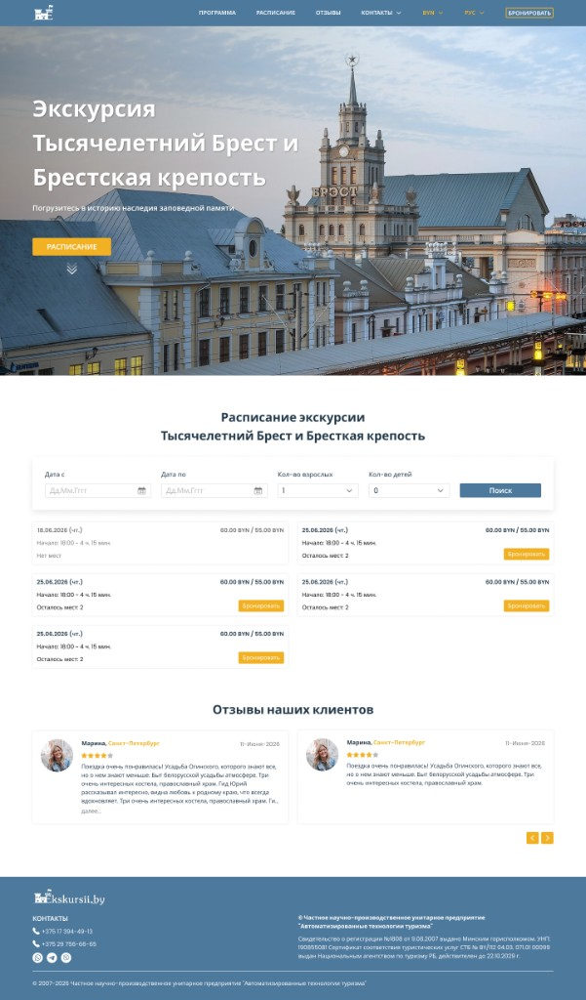

# att-landing

A one-page landing for the excursion **“Millennium Brest and the Brest Fortress”** (Ekskursii.by)

The page brings together the program, date search, schedule cards with booking, reviews, and contacts in one flow — from a full-bleed hero to a footer with legal information. The layout follows the Figma mockup (desktop / mobile), with tablet support and a full header from 1024px up

Some of the logic and JavaScript was built with AI tools

## Run locally

```bash
npm install
npm run dev
```

Open the URL shown in the terminal (usually `http://localhost:5173`).

```bash
npm run build    # production build → dist/
npm run preview  # preview the production build
```

## Links

- **Live demo:** https://att-landing-gray.vercel.app/
- **Figma (working Copy):** https://www.figma.com/design/BV6ObHZj2T0faV9vuyaB0Q/Test-ATT--Copy-?node-id=5-17
- **Figma (original brief mockup):** https://www.figma.com/design/22JSTV3nXks3baQIgEnHAz/Test-ATT?node-id=16-441

## Stack

- **HTML5** — semantic markup, BEM
- **SCSS** — design tokens, nesting, mobile-first
- **Vanilla JavaScript** — ES modules (burger menu, dropdowns, calendar, reviews slider, language, currency)
- **Vite** — build tool, HTML partials via includes
- **Air Datepicker** — the only third-party UI library (date fields in the search form)
- **Font** — Montserrat (local woff2 files)
- **Media** — WebP + JPG via `<picture>`, SVG sprite for icons

Checked with **Lighthouse** (Desktop / Mobile) and the **[W3C Markup Validator](https://validator.w3.org/nu/)**

## Approved deviations

- **Font:** Montserrat instead of Poppins — the web version of Poppins has no Cyrillic. Montserrat was the closest agreed alternative

## Preview



## Highlights

- Layout close to Figma: header, hero, schedule, reviews, footer
- Search form: dates (Air Datepicker), adults/children, cards with price and seat status
- Reviews slider with expand/collapse for long text
- Bilingual UI (RUS / ENG) and currency switch (BYN / RUB / EUR) without i18n libraries
- Responsive: mobile → tablet → desktop
- Accessibility: semantic HTML, focus-visible, aria for custom controls and the carousel
